# [Applets](https://mccambley.github.io/applets/)

## Description

Applets is a collection of small applications designed to make my life easier. These projects accomplish a wide variety of tasks, from helping me calculate what plates to put on a barbell to reach a desired weight, to creating a playlist of new releases from my favorite artists. These projects are designed to be simple, focused, and useful.

## Table of Contents

- [Plate Calculator](#plate-calculator)
- [Financial Assistant](#financial-assistant)
- [Accessible Voice Assistant](#accessible-voice-assistant)
- [Spotify Assistant](#spotify-assistant)
- [SheeeeshBot](#sheeeeshbot)
- [Metronome](#metronome)
- [Bird Proxy](#bird-proxy)

---

<h3 id="plate-calculator">Plate Calculator</h3>

This application helps a weight lifter calculate what plats sould be added to a barbell to reach a desired weight. The user selects the weight of the barbell and the desired total weight, the application then calculates what plates should be added to each side of the barbell to reach the desired weight.

- [**GitHub Repository**](https://github.com/McCambley/plate-calculator)
- [**Live Project**](https://mccambley.github.io/plate-calculator/)

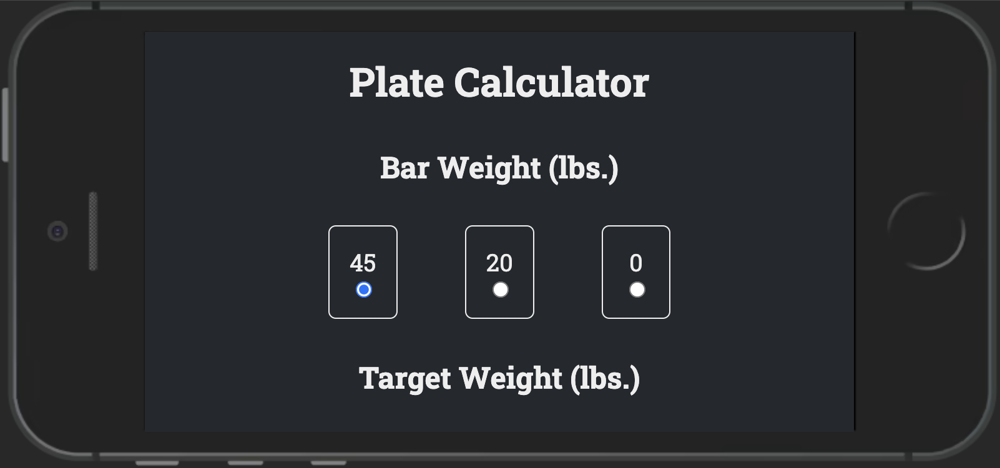

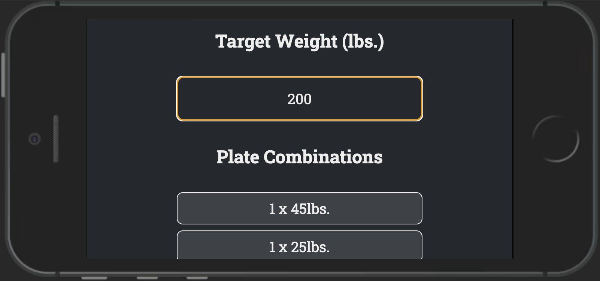

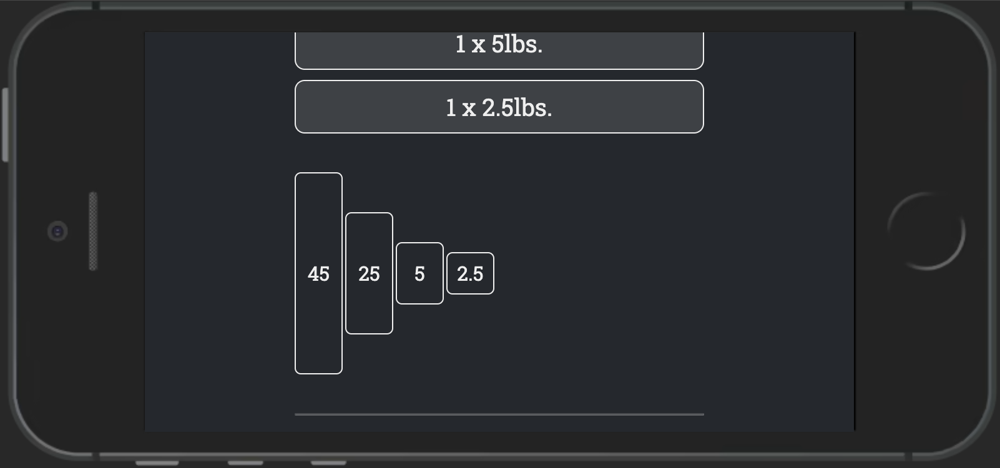

---

<h3 id="financial-assistant">Financial Assistant</h3>

This webpage was built to guide my younger sister along the beginnings of her financial journey. The page is designed to be a simple and informative entry point to the complex world of personal finance. This page has advice, definitions, a budget calculator, links to resources, and a custom chatbot designed to offer approachable financial advice.

- [**GitHub Repository**](https://github.com/McCambley/money)
- [**Live Project**](https://mccambley.github.io/money/)

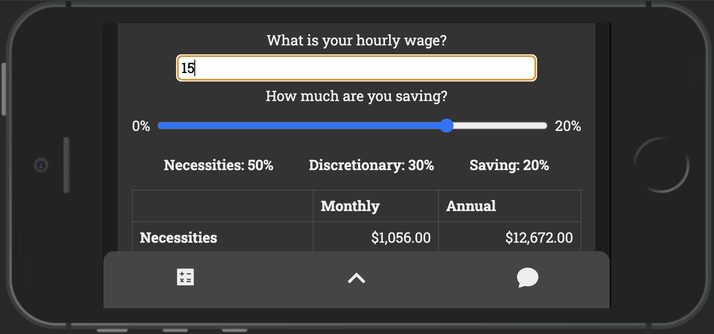
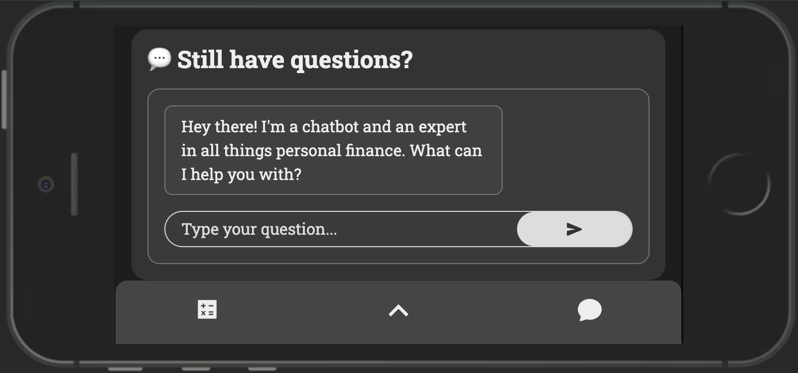

---

<h3 id="accessible-voice-assistant">Accessible Voice Assistant</h3>

Inspired by the tsunami of interest around ChatGPT, I was driven to create a voice activate wrapper around ChatGPT. This application allows the user to speak to their computer and have it respond in kind. The application is designed to be as accessible as possible, with a focus on the user experience.

- [**GitHub Repository**](https://github.com/McCambley/chat-chat)
- [**Live Project**](https://chat-chat-coral.vercel.app/)

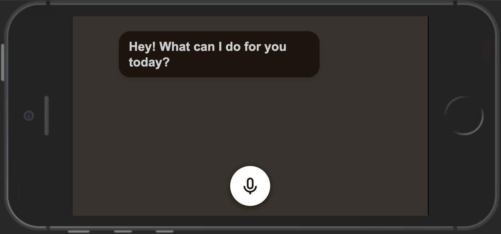
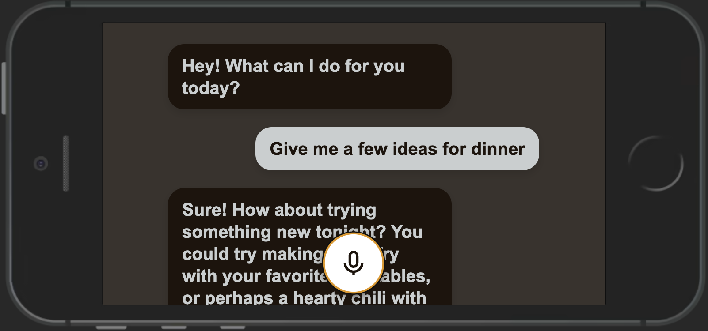

---

<h3 id="spotify-assistant">Spotify Assistant</h3>

I am obsessive about keeping up to date with musicians' releases on Spotify. Every week, if an artists I follow releases a new song, I listen to it. If they release an album, I listen to that album. This application make that process easier, by creating playlists of new songs and albums such that I can stay up to date with my favorite artists as efficiently as possible.

- [**GitHub Repository**](https://github.com/McCambley/releases)

---

<h3 id="sheeeeshbot">SheeeeshBot</h3>

Whenever I hear a song that makes me crunch my face in appreciation, I save that song to a playlist called "Sheeeesh". In hopes of experimenting with the Twitter API before it was placed behind a paywall, I created a bot that would tweet out the latest additions to my "Sheeeesh" playlist so all the world could share in my appreciation.

- [**GitHub Repository**](https://github.com/McCambley/yeeeesh)
- [**Live Playlist**](https://open.spotify.com/playlist/6SeniaKv8gLd9XDKASj2Oi?si=7ffa5b18f5ab4c8b)

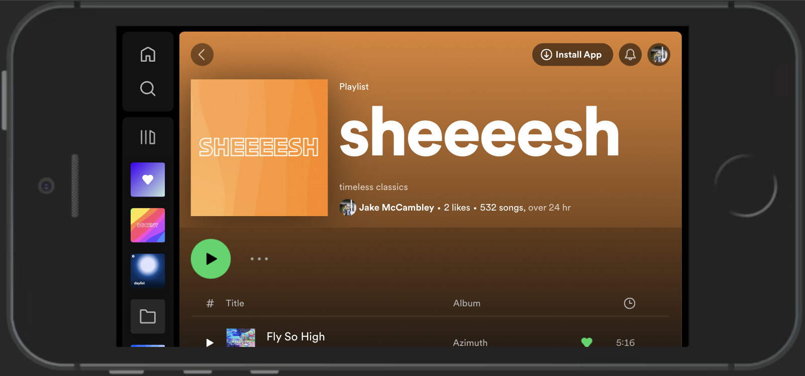

---

<h3 id="metronome">Metronome</h3>

This application is simple. Press a button at the rate of a song, and it will output the tempo of the song you're listening to. I produce music and work a lot with samples. Quickly knowing the tempo of a song enables me to quickly work with samples and create music.

- [**GitHub Repository**](https://github.com/McCambley/metronome)
- [**Live Project**](https://mccambley.github.io/metronome/)

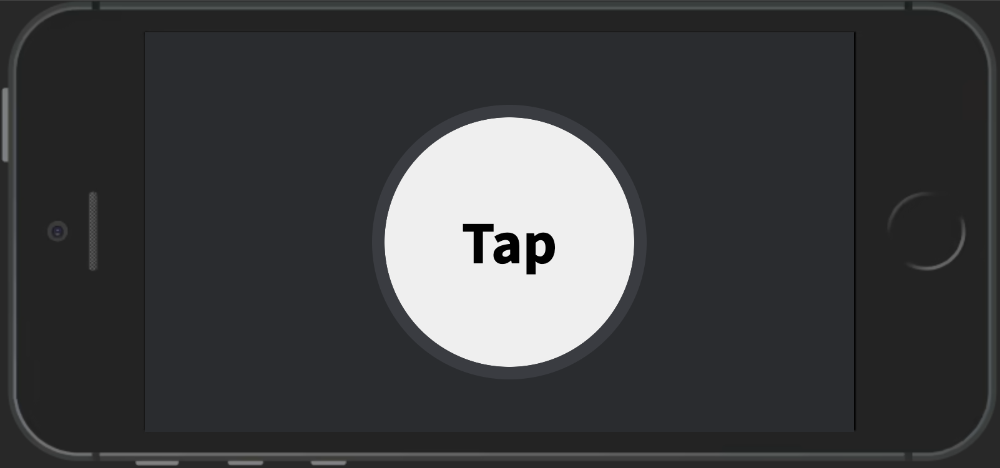
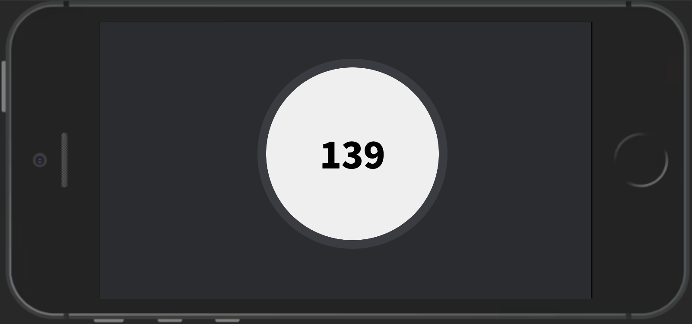

---

<h3 id="bird-proxy">Bird Proxy</h3>

This application is a proxy server for [Aviary](https://github.com/McCambley/hacktober-code-jam), an app that allows users travel the world via bird sounds, entering a zip code and hearing an orchestra of bird calls most recently spotted in that area. This proxy server allows the front end to get data from the [Xeno-canto API](https://xeno-canto.org/explore/api) without exposing the API key to the public.

- [**GitHub Repository**](https://github.com/McCambley/bird-proxy)

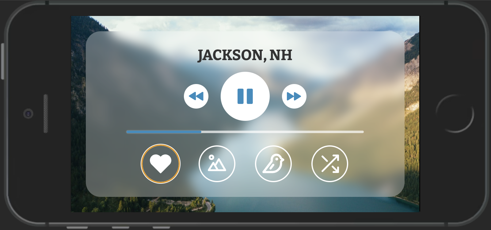
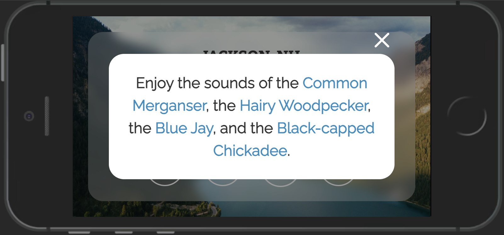
